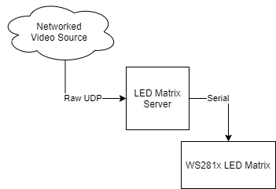

# LED Matrix Server

LED Matrix Server runs on a Raspberry Pi and passes incoming streaming video data to a connected WS2812 LED Matrix.

## Hardware Compatibility

This utility should perform adequately on the following devices:
- Raspberry Pi 3A+
- Raspberry Pi 3B+
- Raspberry Pi 4B
- Raspberry Pi Zero 2

Earlier devices may also work but may run into performance issues, especially with higher framerates.

## Installation

This project has been Dockerised to assist with dependency management and portability. 

Follow these steps on the Raspberry Pi to get this working.

0. Ensure Docker and `docker-compose` are [installed](https://www.docker.com/blog/happy-pi-day-docker-raspberry-pi/) and [working](https://github.com/docker/for-linux/issues/1196)

1. Clone this repo

`git clone git@github.com:aliask/ledmatrix.git`

2. Build the docker image

`docker-compose build`

This will take a while, depending on which model you have.

3. Run it!

`docker-compose up -d`

## Related Projects

https://github.com/aliask/radmat - Stream the BOM weather radar loop
https://github.com/aliask/ScreenCast - Stream a portion of your screen from a Windows machine

https://github.com/rpi-ws281x/rpi-ws281x-python - Library to interface to the LEDs