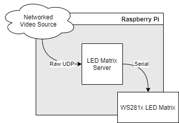
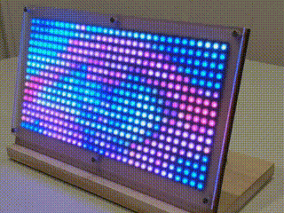
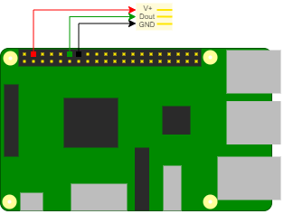
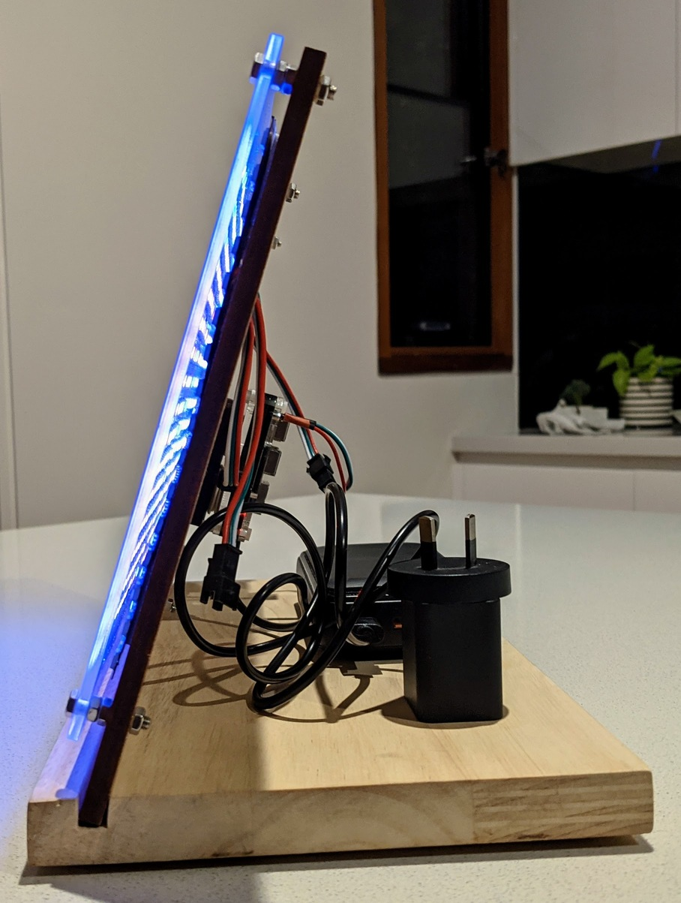

# LED Matrix Server

LED Matrix Server runs on a Raspberry Pi and passes incoming streaming video data to a connected WS2812 LED Matrix.

## Hardware

### Compatibility

This utility should perform adequately on the following devices:
- Raspberry Pi 3A+
- Raspberry Pi 3B+
- Raspberry Pi 4B
- Raspberry Pi Zero 2

Earlier devices may also work but may run into performance issues, especially with higher framerates.

### LED Matrix Module

I used two [16x16 modules from AliExpress](https://www.aliexpress.com/item/1005002320547245.html) wired in series for a display size of 32x16 pixels.

In theory, all of these LEDs could draw more than 10A (1500 individual LEDs), but after connecting to my bench power supply I didn't see anything higher than a couple of amps, even at full brightness.

I decided to be lazy and run the matrix directly from the Raspberry Pi power line, which means making sure your USB power supply is a good brand. It needs to feed the Pi and all these LEDs.

## Installation

This project has been Dockerised to assist with dependency management and portability. 

Follow these steps on the Raspberry Pi to get this working.

0. Ensure `docker` and `docker-compose` are [installed](https://www.docker.com/blog/happy-pi-day-docker-raspberry-pi/) and [working](https://github.com/docker/for-linux/issues/1196)

1. Clone this repo 🐑

`git clone git@github.com:aliask/ledmatrix.git`

2. Build the Docker image 🐋

`docker-compose build`

This will take a while, depending on which model you have.

3. Run it! 👟

`docker-compose up -d`

## Photos

  

## Related Projects

https://github.com/aliask/radmat - Stream the BOM weather radar loop
https://github.com/aliask/ScreenCast - Stream a portion of your screen from a Windows machine
https://github.com/aliask/gifstreamer - Stream a GIF

https://github.com/rpi-ws281x/rpi-ws281x-python - Library to interface to the LEDs